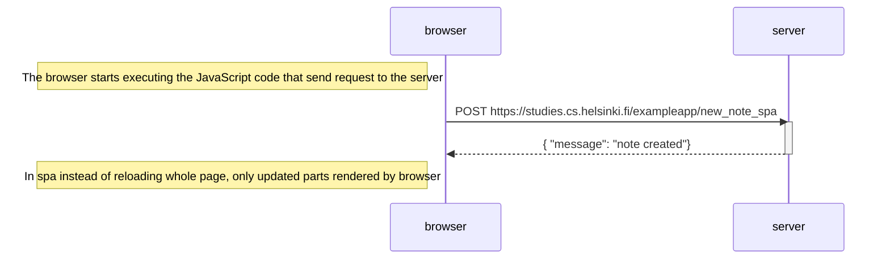

```mermaid

sequenceDiagram
    participant browser
    participant server


    Note left of browser: The browser starts executing the JavaScript code that send request to the server

    browser->>server: POST https://studies.cs.helsinki.fi/exampleapp/new_note_spa
    activate server
    server-->>browser: { "message": "note created"}
    deactivate server

    Note left of browser: In spa instead of reloading whole page, only updated parts rendered by browser


```
